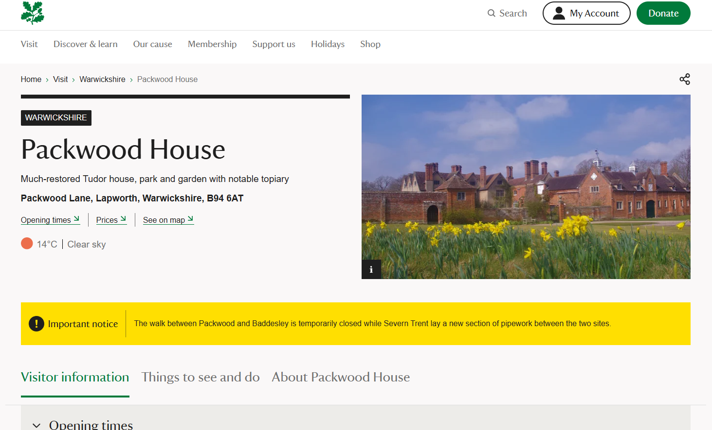

### National-Trust-Weather

Repository for the storage of script to add weather information to properties on the National Trust website, challenge provided by Good Growth.

---

## Solution Overview

The National Trust has tasked me with displaying weather forecasts on their property information pages to provide visitors with real time weather updates for the locations. The goal is to increase the likelihood of users visiting the properties in person by showing them what the weather will be like if they were to visit. The constraints for this project are that I am unable to make any changes to their existing website outside of the weather features, the only access to their existing codebase I will have is whatever I can see inside of Developer Tools on the properties' pages, and that the solution must be implemented as a single script that can be injected directly into the current page. A/B testing should also be considered to review the impact of any potential changes made.

The Solution I have implemented can be broken down into 5 key parts:

- **Location Detection:** Each property page already has the geographical coordinates (latitude and longitude) for the property, so I’ve been able to access that data from the site’s existing code.

- **Weather Data Retrieval:** I was given a mock weather service (https://europe-west1-amigo-actions.cloudfunctions.net/recruitment-mock-weatherendpoint/forecast?appid=a2ef86c41a&lat=27.987850&lon=86.925026) that I can pull from to obtain forecast data. I dynamically changed the lat= and lon= values in the URL with the existing latitude and longitude data I have already discovered on the property pages. This now made it so the weather data that is retrieved is specific to the location being shown on whichever properties' page you are visiting.

- **Current Weather Recognition:** When a request is made for the weather data, it retrieves ALL of the available upcoming forecasts for that location. As each forecast has a date and time stamp for when that forecast is for, I am able to compare these to the current time when the data is collected and only pull out the closest upcoming forcast. Once I have this specific dataset, I can pull out the values I want such as the temperature or description of the weather, and adjust them for how I want it to show on the page.

- **Next 3 Day Averages:** Now that I have the current date and time, I then use the same weather data to get the forecasts for the next three days. These can then be grouped together into each individual day, and have the temperature values across the day averaged out and stored.

- **Displaying the Data:** Finally, I design a section to display the weather data on the page in a way that matches the website’s existing style. I then add this section to a part of the page that fits with the current layout.

## How to use

1️⃣ Accessing the website

Go to any National Trust property page in Google Chrome such as:

- https://www.nationaltrust.org.uk/visit/warwickshire/packwood-house
- https://www.nationaltrust.org.uk/visit/shropshire-staffordshire/moseley-old-hall

2️⃣ Accessing Chrome Dev Tools

- Once on the page, either right click anywhere on the page and select inspect, or press the F12 key to open the Developer Tools on the right side.
- Click on the third tab labelled "Sources" along the top of the pop up.

3️⃣ Chrome Snippets

- Just under the Sources tab you just clicked, click the >> icon and select "Snippets."
- Click "+ New snippet" and feel free to call it whatever you want (Weather Injection, NT Weather etc.)
- Copy all of the code from inside of "weather.js" and paste it inside of your snippet, press "ctrl" + "s" to save.
- Right Click your snippet and select "Run."

## A/B Testing

To perform A/B testing, I compared the expanded design I have posted at the top "A" with the minimalistic design below here "B".

Since this is only a mock challenge, I am unable to track the real statistics typically associated with this type of testing. In a real scenario, I would focus on metrics like the number of clicks on sections such as prices and opening times to gauge if users are continuing their journey, as well as booking statistics to see if there’s a significant increase in actual bookings. If I observed notable changes in these metrics, I would then repeat the test with an adjusted version of the less interacted-with solution to determine if there are additional aspects of design or functionality that could be transferred to the more successful version instead of fully discarding it.

I created two sepeate Google Forms with the same questions for each design and then put out a request to my School of Code bootcamp along with some friends to let me know if they would be willing to submit a response, to which then I would send them 1 of these forms so that I can keep the amount of responses equal for both designs. While this is not ideal as they are not the primary audience that would be looking at these pages, that would be existing National Trust members, it still allows me to get some basic feedback on the overall success of the designs and find out which one stands out above the other within the time constraints on completing this tech test.

The questions posed were:

- Does the weather information provided give you a full understanding of the conditions at the location? | Yes/No
- Do you think the placement of the weather feature on the page is appropriate? | Yes/No
- On a scale of 1 to 5, how visually appealing do you find this design? | 1-5
- On a scale of 1 to 5, how likely would this weather feature influence you to book a visit to the property? | 1-5
- If you have any further comments or suggestions regarding the weather feature, please write them here. | Non-mandatory, Open Ended

I managed to get 22 people to respond, giving me 11 results for each survey. The core results were:

- 1A: 10 Yes / 1 No
- 2A: 8 Yes / 3 No
- 3A: 0 One / 1 Two / 2 Three / 5 Four / 3 Five
- 4A: 1 One / 0 Two / 3 Three / 4 Four / 3 Five
- 5A Summary: An overall professional design that fits with the webpage. More spacing between date and time would enhance readability. Adding day names for the 3-day forecast, a visual representation of wind speed, and some more icons would improve the overall design.

- 1B: 3 Yes / 8 No
- 2B: 6 Yes / 5 No
- 3B: 3 One / 3 Two / 3 Three / 1 Four / 1 Five
- 4B: 2 One / 3 Two / 5 Three / 1 Four / 0 Five
- 5B Summary: The weather feature needs clearer visibility, better organization (e.g., morning/afternoon conditions), and live updates for changing conditions. Also, consider adding Fahrenheit and repositioning the weather for easier access.

The feedback results suggest positive opinions on the A design and functionality of the weather feature, while design B was too simplistic and even difficult to pick out on the page for some users along with lacking actual data. The ideas I would be looking to take from this is the quality of life changes such as adding the day names to the different dates so users will know what day the weather refers to at a glance, as well as adding more icons in to help visualise what the conditions are. The positioning of the weather being just under the main title of the page also seems to be a good place to leave it as it was around there in both designs and received a favourable vote in the majority. Design A got overwhelmingly more positive votes on the visuals over design B, telling me that people want to see more instead of a minimalistic aesthetic. The most important information that I got from these surveys is that over 72% of the people feel that having this extra weather feature would positively influence them to actually make a booking to go visit the property after viewing the page.

## Challenges & Learnings

- Used the same font family as the website do, however they have their own font included as the first option (NationalTrustTT) which I do not have access to due to their server side CORS policy.

  

- I found the mock data itself more difficult to work with than using an actual Weather API such as https://open-meteo.com/ or https://openweathermap.org/, due to not containing past weather data, and the randomness of the data as it changes each call and updates the time fields every hour, with the first available data always being 3 hours from current hour, then having intervals of 3 hours after eg. a call at 16:10 would show 19:00, 22:00, 01:00 etc. Using Postman helped me clarify that this was how the data worked and assisted in being able to work with it.

  

- Re-discovering the Chrome Dev Tools has been a great learning experience as I have only briefly used them before during School of Code for light debugging and basic Dom manipulation. Learning things such as seeing an elements styling when clicking into it, my first introduction to Chrome Snippets, filtering inside of the network tab to help refine what you are searching for (Existing Fetch/XHR to see if there was anything I could pull) and the application tab to view the sites cookies and different types of storage.

## Future Improvements

- Expand on the forecast for the days to come so that it visually looks more appealing, my idea is to have buttons that will change the data shown with access to choose between the times we have data for, instead of it just being boxes with the average temperature. This would be more informative for people looking to plan a visit in advanced, as they can narrow the weather data down to a specific time and date.
- I'd like to see if there is an interactive map that includes rainfall available for use somewhere as that would be a nice edition to show how long the rain will be active over the property and could also encourage visitation to other nearby properties if they have better weather.
- More thorough A/B testing about different aspects that I would actually be able to test for in this mock environment such as the design, types of content and interactability.
