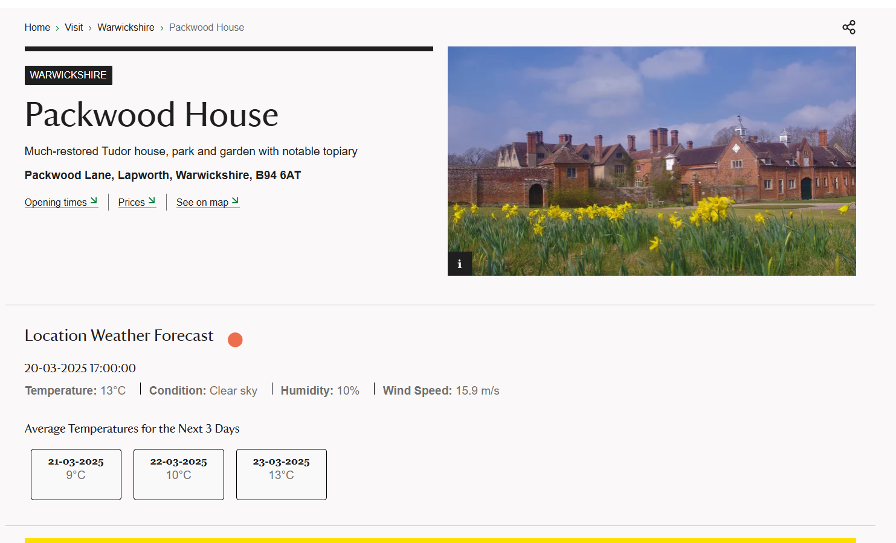
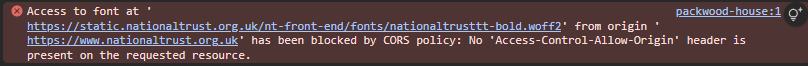
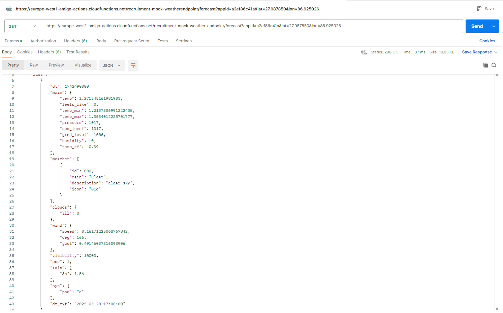

### National-Trust-Weather

Repository for the storage of script to add weather information to properties on the National Trust website, challenge provided by Good Growth.

---

## Solution Overview

The National Trust has tasked me with displaying weather forecasts on their property information pages to provide visitors with real time weather updates for the locations. The goal is to increase the likelihood of users visiting the properties in person by showing them what the weather will be like if they were to visit. The constraints for this project are that I am unable to make any changes to their existing website outside of the weather features, the only access to their existing codebase I will have is whatever I can see inside of Developer Tools on the properties' pages, and that the solution must be implemented as a single script that can be injected directly into the current page. A/B testing should also be considered to review the impact of any potential changes made.

The Solution I have implemented can be broken down into 5 key parts:

- **Location Detection:** The Latitude and Longitude needed to find the weather data is already available within the website's code, so I was able to extract these values and reuse them.

- **Weather Data Retrieval:** I was given a mock API endpoint (https://europe-west1-amigo-actions.cloudfunctions.net/recruitment-mock-weatherendpoint/forecast?appid=a2ef86c41a&lat=27.987850&lon=86.925026) which is where the weather data is stored. I dynamically changed the lat= and lon= values in the URL with the existing latitude and longitude data I have already discovered on the property pages. This now made it so the weather data that is retrieved is specific to the location being shown on whichever properties' page you are visiting.

- **Current Weather Recognition:** When a request is made for the weather data, it retrieves ALL of the available forecasts for that location. Each forecast includes an element named "dt" which is a universal date and time stamp for when that forecast is for. By using the current time of when the call is made, I can compare this to all of the "dt" values, and only collect the specific forecast that is closest in the future. Once I have this specific dataset, I can pull out the values I want such as the temperature or description of the weather, and adjust them for how I want it to show on the page.

- **Next 3 Day Averages:** Now that I have the current date and time, I can query the initial API call that includes all the upcoming forecasts, and have it search for only the datasets that have a "dt" code for the next 3 days. These can then be grouped together into each individual day, and have the temperature values across the day averaged out and stored.

- **Displaying the Data:** With the relevant data extracted, all that is left is to do is create a container to put all of these values, style it to match the aesthetic of the existing site and decide where on the webpage this container will be put by using an existing part of the site as a reference.

## How to use

1️⃣ Accessing the website

Go to any National Trust property page in Google Chrome such as:

- https://www.nationaltrust.org.uk/visit/warwickshire/packwood-house
- https://www.nationaltrust.org.uk/visit/shropshire-staffordshire/moseley-old-hall

2️⃣ Accessing Chrome Dev Tools

- Once on the page, either right click anywhere on the page and select inspect, or press the F12 key to open the Developer Tools on the right side.
- Click on the third tab labelled "Sources" along the top of the pop up.

3️⃣ Chrome Snippets

- Just under the Sources tab you just clicked, click the >> icon and select "Snippets."
- Click "+ New snippet" and feel free to call it whatever you want (Weather Injection, NT Weather etc.)
- Copy all of the code from inside of "weather.js" and paste it inside of your snippet, press "ctrl" + "s" to save.
- Right Click your snippet and select "Run."

## A/B Testing

## Challenges & Learnings

- Used the same font family as the website do, however they have their own font included as the first option (NationalTrustTT) which I do not have access to due to their server side CORS policy.
  
- I found the mock data itself more difficult to work with than using an actual Weather API such as https://open-meteo.com/ or https://openweathermap.org/, due to not containing past weather data, and the randomness of the data as it changes each call and updates the time fields every hour, with the first available data always being 3 hours from current hour, then having intervals of 3 hours after eg. a call at 16:10 would show 19:00, 22:00, 01:00 etc. Using Postman helped me clarify that this was how the data worked and assisted in being able to work with it.
  
- Re-discovering the Chrome Dev Tools has been a great learning experience as I have only briefly used them before during School of Code for light debugging and basic Dom manipulation. Learning things such as seeing an elements styling when clicking into it, my first introduction to Chrome Snippets, filtering inside of the network tab to help refine what you are searching for (Existing Fetch/XHR to see if there was anything I could pull) and the application tab to view the sites cookies and different types of storage.

## Future Improvements

- Expand on the forecast for the days to come so that it visually looks more appealing, my idea is to have buttons that will change the data shown with access to choose between the times we have data for, instead of it just being boxes with the average temperature. This would be more informative for people looking to plan a visit in advanced, as they can narrow the weather data down to a specific time and date.
- I'd like to see if there is an interactive map that includes rainfall available for use somewhere as that would be a nice edition to show how long the rain will be active over the property and could also encourage visitation to other nearby properties if they have better weather.
- More thorough A/B testing about different aspects that I would actually be able to test for in this mock environment such as the design, types of content and interactability.
